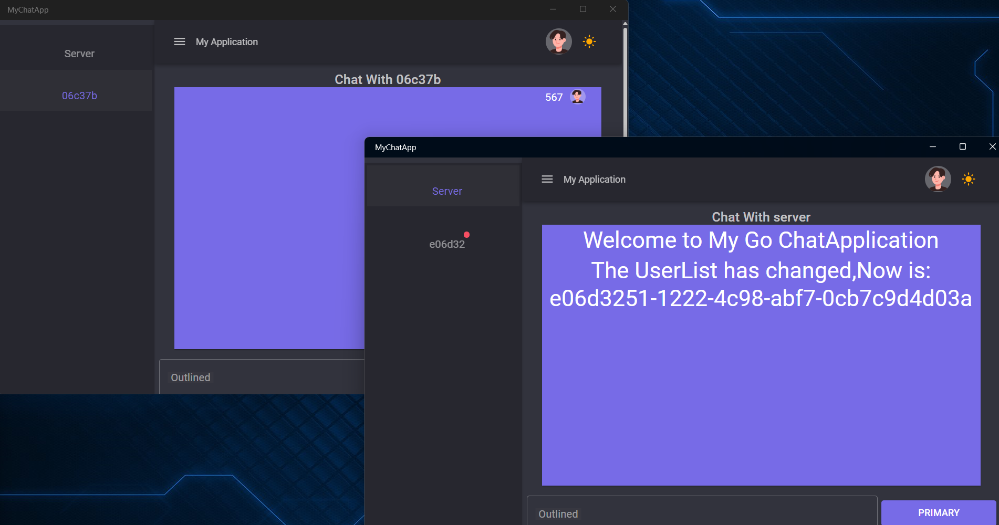
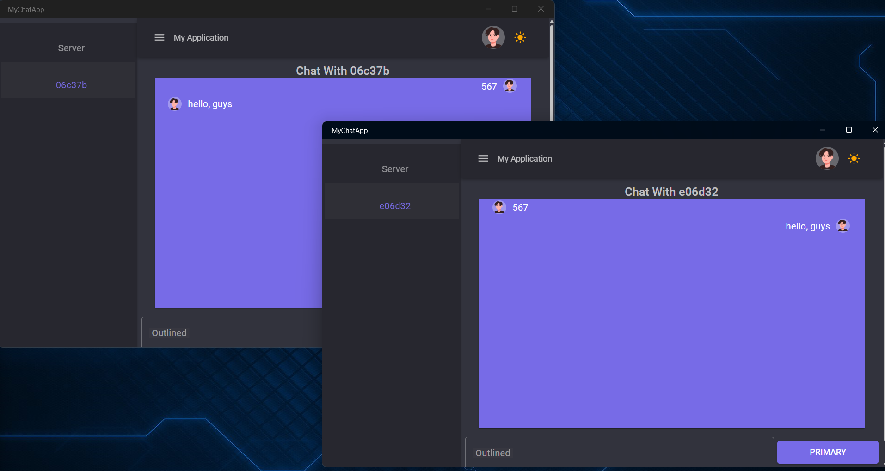
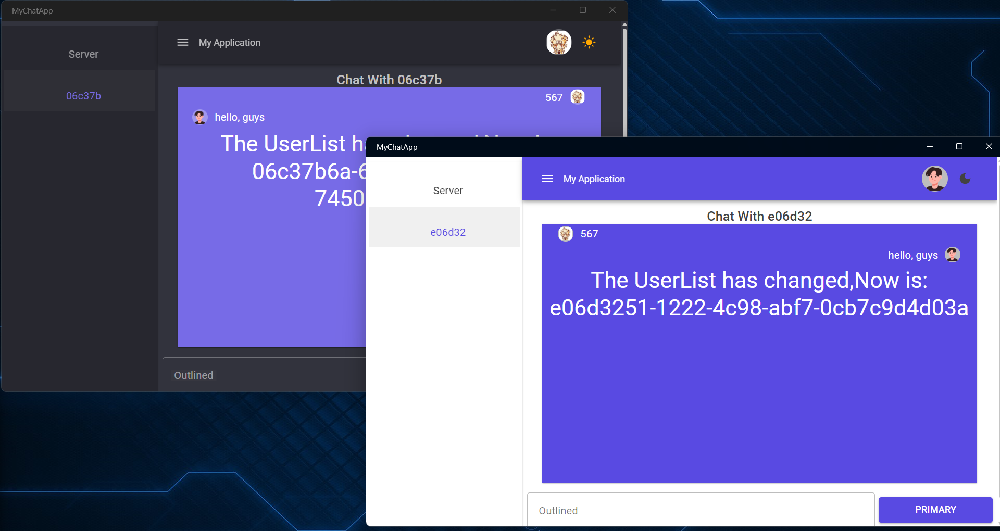
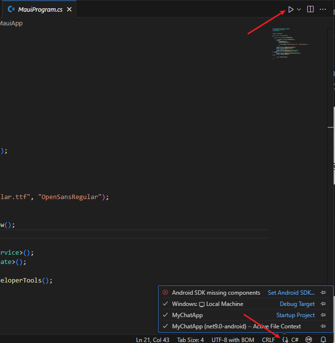

# Go-C# WebSocket Chat Application

[中文版](README_zh.md)

## Project Introduction

This is a WebSocket chat application built with Go and C#. The backend uses Go to provide WebSocket services, while the frontend leverages the Maui Blazor hybrid framework for a modern user interface. The application supports real-time messaging, dynamic user list updates, and broadcast messages. It is implemented via WebSocket for bidirectional communication, making it suitable for learning purposes and small-scale chat applications.

------

## Project Screenshots

### Chat Interface







### Backend Logs

- Logs for user connections, disconnections, and message forwarding.

------

## Features

1. **Real-time Messaging**: Enables users to send and receive messages in real time.
2. **Broadcast Messages**: Admins can send global broadcast messages via the terminal.
3. **Dynamic User List**: Displays active users, automatically updated when users join or leave.
4. **Avatar Management**: Allows users to customize their avatars, with updates visible to others in real time.
5. **Message Storage**: The frontend stores chat history for users to view past conversations.


------

## Usage

### Prerequisites

1. Install the latest version of Go.
2. Install .NET 9.0.
3. Ensure `curl` or another tool is available to test the WebSocket service.

------

### Quick Start

#### Install MAUI Workload

Run the following command:

```bash
dotnet workload install maui
```

#### Set Up Development Environment

Open the project in `VSCode` and install the following extensions:

- `.NET Install Tool`
- `.NET MAUI`
- `C#`
- `Go`

------

#### Backend

1. Navigate to the backend directory `GoChatServer`.

2. Start the Go service by running:

   ```bash
   go run main.go
   ```

3. The WebSocket service will run at `http://localhost:8008/ws`.

------

#### Frontend

1. Navigate to the frontend directory `MyChatApp`.

2. Restore project dependencies:

   ```bash
   dotnet restore
   ```

3. Open the `MauiProgram.cs` file. You should see something like this:
   

   - Click `Debug Target` at the bottom.
   - Run the project by clicking the Run button.

------

### Additional Notes

It is recommended to modify the save location for images in `MyChatApp\Components\Layout\ProfilePopover.razor`. Currently, images are saved in the project runtime directory. For production, consider using a third-party hosting service.
The main application logic resides in `MyChatApp\Components\Pages`.


## Project Structure

### Backend (Go)

- Provides WebSocket services and listens on port `8008`.
- Manages user connections, message forwarding, user list broadcasting, and disconnections.
- Built with the `gorilla/websocket` library for WebSocket communication.

Key files and functions:

- `main.go`: Main program handling user management and message processing.

### Frontend (C#)

- Built with Maui Blazor hybrid and MudBlazor frameworks to deliver a modern chat interface.
- Connects to the backend WebSocket service for real-time communication.
- Supports displaying various message types, including system and user messages.

Key files and functions:

- `Chat.razor`: Chat interface component, responsible for rendering the chat window and user messages.
- `ChatService.cs`: Logic for communicating with the backend WebSocket service.


## Project Dependencies

### Backend Dependencies

- `github.com/gorilla/websocket`: For WebSocket functionality.

### Frontend Dependencies

- `MudBlazor`: To create a modern UI.
- `.NET WebSocket`: For backend communication.

------

## Contribution Guide

We welcome suggestions and code contributions to this project:

1. Fork the repository.

2. Create a feature branch:

   ```bash
   git checkout -b feature/<your-feature>
   ```

3. Commit your changes and submit a Pull Request.

------

## License

This project is licensed under the MIT License.