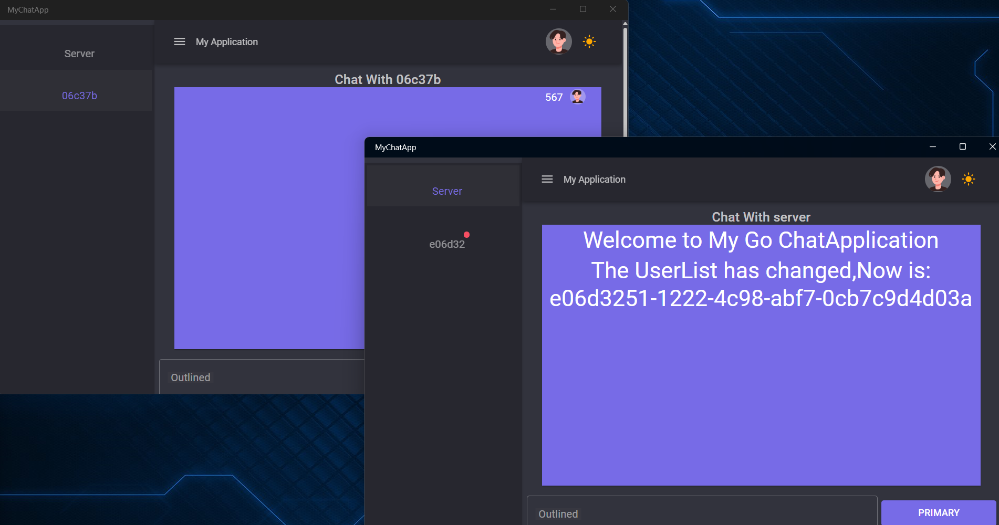
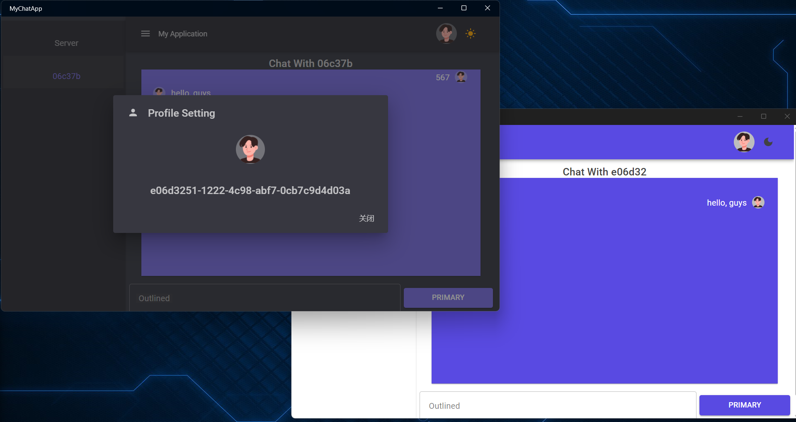
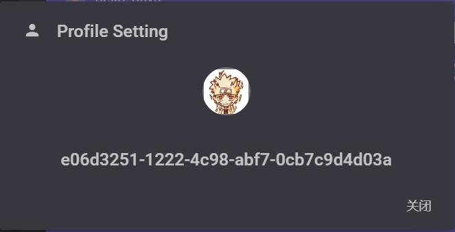
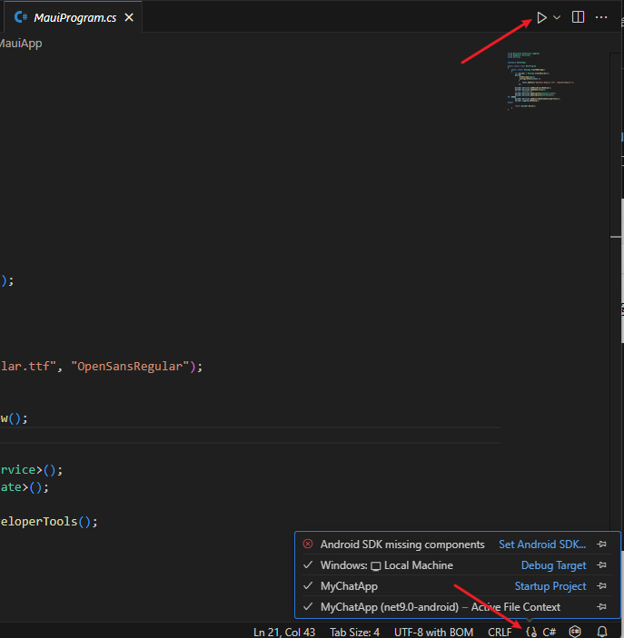

# Go-C# WebSocket 聊天应用

[English Version](README.md)

## 项目介绍

这是一个基于 Go 和 C# 的 WebSocket 聊天应用。后端使用 Go 提供 WebSocket 服务，软件端使用Maui Blazor hybrid搭建界面。支持用户实时聊天、用户列表动态更新和广播消息。通过 WebSocket 实现双向通信，适合用于学习和小型聊天应用的开发。

## 项目截图

### 聊天界面






### 后端日志

- 用户连接、断开和消息转发的日志信息。

## 功能特点

1. **实时消息传递**：用户之间可以实时发送和接收消息。
2. **广播消息**：支持管理员通过终端发送全局广播消息。
3. **动态用户列表**：实时显示在线用户，用户加入或离开时自动更新。
4. **头像管理**：支持用户自定义头像，其他用户可实时看到更新。
5. **消息存储**：前端支持存储聊天记录，方便用户查看历史消息。

## 项目结构

### 后端（Go）

- 提供 WebSocket 服务，监听端口 `8008`。
- 管理用户连接，包括消息转发、用户列表广播和断线处理。
- 通过 `gorilla/websocket` 库实现 WebSocket 通信。

主要文件和功能：

- `main.go`：主程序，包含用户管理和消息处理逻辑。

### 前端（C#）

- 使用 Maui Blazor hybrid 和 MudBlazor 框架构建，提供现代化的聊天界面。
- 通过 WebSocket 连接后端服务，实现实时通信。
- 支持多种消息类型的展示，包括系统消息和用户消息。

主要文件和功能：

- `Chat.razor`：聊天界面组件，负责渲染聊天窗口和用户消息。
- `ChatService.cs`：与后端 WebSocket 服务通信的逻辑。

## 使用方法

### 前置要求

1. 安装 Go 最新版本。
2. 安装 .NET 9.0 
3. 确保终端可用 `curl` 或其他方式测试 WebSocket 服务。

### 快速开始

安装Maui负载：`dotnet workload install maui`

打开`Vscode`，安装`.NET Install Tool`,`.NET MAUI`,`c#`,`Go`扩展，打开项目

#### 后端

1. 进入后端目录`GoChatServer`。

2. 执行以下命令启动 Go 服务：

   ```bash
   go run main.go
   ```

3. 服务将在 `http://localhost:8008/ws` 上运行。

#### 前端

1. 进入前端目录`MyChatApp`。

2. 安装项目依赖：

   ```bash
   dotnet restore
   ```

3. 打开`MauiProgram.cs`文件，然后你会看到

下方点击`Debug Target`,上方点击运行即可。


建议修改`MyChatApp\Components\Layout\ProfilePopover.razor`中保存图片的位置，目前是存到项目运行处，建议改为第三方托管位置
主要代码在`MyChatApp\Components\Pages`中

## 项目依赖

### 后端依赖

- `github.com/gorilla/websocket`: 用于实现 WebSocket 功能。

### 前端依赖

- `MudBlazor`: 用于构建现代化 UI。
- `.NET WebSocket`: 实现与后端的通信。

## 贡献指南

欢迎对本项目提出建议或贡献代码：

1. Fork 本项目。

2. 创建功能分支：

   ```bash
   git checkout -b feature/你的功能
   ```

3. 提交代码并发起 Pull Request。

## 许可证

本项目基于 MIT 许可证